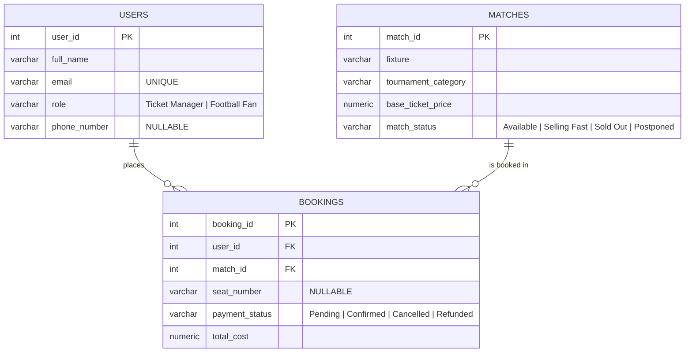

# ⚽ Football Ticket Booking System

A simplified **Football Ticket Booking System** database built with **PostgreSQL**.
This project covers database design (ERD), table creation with proper constraints, and intermediate-to-advanced SQL queries.

> **Assignment:** B7A3 — Database Design & SQL Queries (Programming Hero, Next Level)

---

## 📌 Entity Relationship Diagram (ERD)

> 🔗 **Public ERD Link:** [View the ERD on diagrams.net](https://viewer.diagrams.net/?tags=%7B%7D&lightbox=1&highlight=0000ff&edit=_blank&layers=1&nav=1&title=ERD.drawio&dark=auto#R%3Cmxfile%3E%3Cdiagram%20id%3D%22football-erd%22%20name%3D%22Football%20Ticket%20Booking%20ERD%22%3E7V1tc5s4EP41zKUfkgH8Buej7dpt55w05zR3vU8ZGWSbKSCPkGO7v%2F5WQrwZ4doJ6Yic20wiFiGkfXYfgXYBozUMtp8oWi1viYt9wzbdrdH6aNi2ZZld%2BMMlu1hybVmxYEE9V1bKBA%2FeTyyFppSuPRdHhYqMEJ95q6LQIWGIHVaQIUrJplhtTvziWVdogUuCBwf5Zek%2FnsuWybi6N9mOz9hbLOWpe7YccICSynIk0RK5ZJMTtUZGa0gJYXEp2A6xz5WX6CU%2BblyxN%2B0YxSE75gDmMRhU6SDZTsR2yZAZ3sK%2BwZIFPggsKEaMkh94SHxCQRKSEGoO5p7v74mQ7y1C2HSgdQzywTOmzANl9uWOwHNdfprBZukx%2FLBCDj%2FnBkwHZJSsQxfz3pq8eRIyaQ52ui07yfsUd%2FsZ%2BWvZ7TFocobEkL95zg%2FMoDAg5IcXLqD0sIsYDqBgjGyjZxo3bSiPpnCgeQEgbP6IoMSbgD93hCHmkfCDPAcMAm9z2pL6%2FYRJgBndQZVlzgLaEu9NZi7XppTJVtI60ikSE0HSWBdpyxmeUJCQquFdR5hGx8ALdrjiRYZmAoqIIZpousU1Da7EkBdyAIWmHeL7aBV5orrAxll6vjtBO7JmSUPJFpjFFrvT2O8sgepmAo0lm%2Fsw5mC22ioTojiC3RMUseSInN0ZdstFuDd3SkYKe7pOD8%2FmKlN5zHR1IrhWr4xuaw%2FdPXCtdl3oXlKF0%2BdwrwJ5ymlnsCTU%2B8mh9SWKeeDF9sYLfBQCnSF3TzQggr9NtduXDcSlZPUN0QVmUrAiXsjE%2BDsD%2BAGNDM2rjtGBvg5h28q24YdXp2xIQoAUDJG3gQH%2FDeY2MGBkJRv18Txpn0qIeHlGGCOB3Chh%2FyLYWwdQ3xWr1IHyjwqYUwNQIA2VmYf8KUyCKFwIzyYwyrkv5pwlEC8OY%2Bfm8yTKsFIAqlRxQa15fatcOueGg16n3VFCcf9nXWDU6WJho5Sf8GVcdxDBlAoT3iQ%2BsruHTkeFAh%2FcEyiBz7J9PlOOpl%2F6k7qQsbtqcqwBKftMhrqSYbdGlKvJ0NbQH99MxXU6TjXF6ajSX1JcSefzte8%2FhSjAKan93Z8OP%2FenF5Zpvuyq%2FvdSW%2BtMbbpS202NKFdTW0tDP2wCtbWqqU1HlZ5ObThAnl9Bayb%2F6Qwe77789TgSPqc90bXPRKcr0Vm1rUoBzNVM19bQLZvAdO1qptNRpcfdp8qFQOX6LiV%2B%2BXrOzvFeuup7i0K0wJRLr0GdZm5leIzCZhBj50yM2hJjp0aYq4mxo6EXN4EYO9XEqKNKX0%2BMqyWc9ylcB7OY8yoJ8u5xMukPJrpfGs7ioN3%2FMpjVwT23bSiCWT171uoq7wgGBXWdCGkaZz8Uz3qLgFYCsjKmVbSA82TX8LBWDmvFdFeyBK3o%2BZ0Et3JKVkyPekPw%2BhCXHF%2BzolwZKPaZITVmyDpiXTmsDzKkraF7%2FoIhu8PeaDBWATLWlCFV4TG9ITiJIW0VFvtJAF%2FuvsnbBp4u1zVueH2RNnWVVm0CdSoCaWfq1IY664il5bA%2BSJ06hn%2FeHXWqwm96Q%2FB66gwQc5a%2F5M5bXgtHV1ntJtCnIjx3pk9t6LOWCF0O7IP8qWNQ6c00XbMXHWRFHRX7%2BkXpCCNWtSZtNXdNWhmYO1OiPpRYR2wuB%2FZBStQxnNQQSlQF6fRW7CmUeKMCYoV2AYz1CRyeraMSKeYDdfc4dOPH1uIEBnDCuUcD7GYSFDqg25xkiufx43NNIdLumUh1JtJevWAfJNKuhv7eECLtHiRSHRV7es4rI%2BDlTw6JWMqad4%2B3o%2BmX4QUPXw9trVP6g%2FjOvwzTu89mmM9x11E%2Bmute38xMpZfd5rX1Bg%2Fn9t4imUFCrMxlKMB%2FntIansqQIa2Y0PbNQCvafSeJDJmOFROf1gC8Po2htNKsfxJDioh9ZkZ9mbGOFIYM6UPMaGvomFpf6WeaO8R3Oqr1BY%2Ftelu2ps17aDeFQZFtcCY5XUiujmSDDOlDJKdjnLsZJKfKH9BarS9ZzFhT%2FmqCkD05iOEFEUouEl6nIXynSA84850ufFdLdkAG9SHC0zGE3QzCU6UGaK3W0wlvhiL8xMSzuU8r6jnZ9V3zFnGV4f8z5WlDeXVE%2FzOoD1GejiHqZlCeKvSvtVpfHfmP1%2B2OiPv3n5Hni64nUf0HUGKcCTBGcfgrFvPXGNvm13UmuicRW8HwdE8AoNi%2FjB%2FHLkb7sVt6EXM5VAbXzo6sVflORt5QsowKDXhsN8W%2BeJ%2FvKNtTCG7ZRnl5HG899j1X%2FpcbwxVfloU26e67tA2xke0TdN7nr50G0WgaoND9KixO7Bh7vp8e52bVfmJKvpFbFO7iPbl6xXcix3G05D3UWTYyS2jeUDypkk9B8ZETT1RlU6BCSc9FDF4N9Oyy%2BH5u6ZdG%2BsrjPMpVprEH7gTNsG8UXlB9%2FIunRcwyxw7FSfHjEZZR0qp1tLspdSwPuTSvrjvVWpeN3fPuZhPepWUXDyHzecTfgbIHU9qHU5AL3z1yd7UgpxdwyVT6OnY9EEmrl1%2FNan61NOfXVsmePD698woiL88LfyPTBiczrdpQNPfYd8m1wclc20js3hvb%2BngBZFJNp8d%2FUYM%2F6yf%2BGeUcqg7%2FX74L2QdO3NIc8VkNeffCu2EqQCyBZthdn59vBoUFL0zkqGMx6Cjdk1al1RKeTGKKls176gVIwP0n5r8vZvFNjWHDcSbvM4VbH%2Fyh3Mg4a2RMKOYKSBvxGCjKURx0QJIIit8B4XdpRw1yZBs3Y6PfS74s0k17h7fIYT7vF7%2FvhN7xCQsxQneqDvJ2ro0ePwUKOHLy5LIxPovxluAAM%2BBz2UuGmEzV0VJ8QOeEIcLI%2Btw2voqR8EfBjf0nHHmfkk%2BucDVegKX37yqGmrRXPizfaHw2kRTIG7yDBq1fNDhCom726Rd%2BGVCFSDIOYXOkeDKfLLiHQZGPw%2BJeLioDNWL6LKZ4%2FpTTy9YtlctZvb3b7b1cxfYLVvRhM%2FvEUExy2YeaWqP%2FAA%3D%3D%3C%2Fdiagram%3E%3C%2Fmxfile%3E)
>
> The editable diagram source is also included in this repo: [ERD.drawio](ERD.drawio) (open it at [app.diagrams.net](https://app.diagrams.net)).

### Relationships

| Relationship | Type | Explanation |
|---|---|---|
| Users → Bookings | **One to Many (1:N)** | A single football fan can buy tickets for multiple matches throughout the season. |
| Bookings → Matches | **Many to One (N:1)** | A major derby match can be associated with thousands of individual booking records from different fans. |
| Booking row → (User, Match) | **One to One (logical)** | Each individual booking row maps exactly one user to one match for that specific reserved seat. |

---

## 🗄️ Database Schema

The full schema with sample data lives in [setup.sql](setup.sql). Key design decisions:

- **`SERIAL PRIMARY KEY`** on all three id columns — auto-incrementing, unique, and never NULL.
- **Foreign keys with referential integrity:** `bookings.user_id → users.user_id` and `bookings.match_id → matches.match_id`. A booking can never point to a user or match that doesn't exist.
- **`ON DELETE CASCADE`** — if a user or match is removed, their bookings are cleaned up automatically instead of becoming orphans.
- **`CHECK` constraints on status fields** — `role`, `match_status`, and `payment_status` only accept their defined values (e.g. `payment_status` must be `Pending`, `Confirmed`, `Cancelled`, or `Refunded`).
- **`UNIQUE` on `users.email`** — two accounts can't share a login address.
- **Nullable by design:** `phone_number`, `seat_number`, and `payment_status` allow NULL because the business data genuinely can be missing (an unallocated seat, an unresolved payment).
- **`NUMERIC(10,2)` for money** — exact decimal arithmetic; `FLOAT` would introduce rounding errors.

| Table | Purpose |
|---|---|
| `users` | Administrative staff (Ticket Manager) and customers (Football Fan) |
| `matches` | Tournament events with baseline ticket pricing and availability status |
| `bookings` | Transactional records linking one user to one match per reserved seat |

---

## 🔍 SQL Queries

_(The 7 queries with explanations will be added as they are completed — see [QUERY.sql](QUERY.sql))_

---

## 🚀 How to Run

_(Setup instructions will be completed at the end)_
